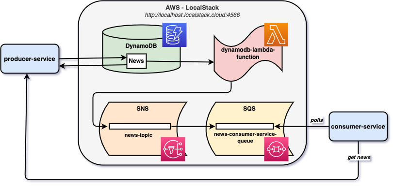
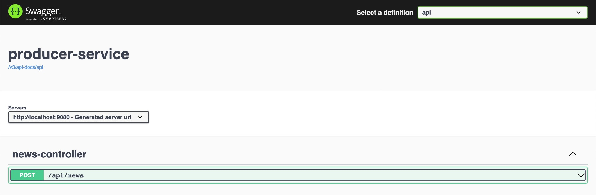
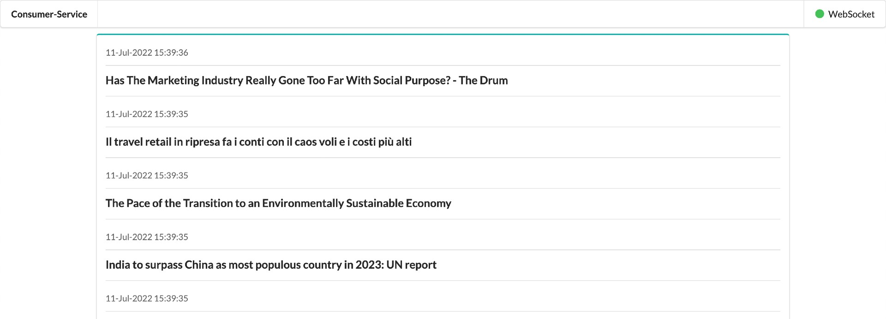

# springboot-aws-localstack-dynamodb-sns-sqs

In this project, we are going to use [`LocalStack`](https://localstack.cloud/) to simulate locally, some services provided by [`AWS Cloud`](https://aws.amazon.com/) such as [`DynamoDB`](https://aws.amazon.com/dynamodb/), [`SNS`](https://aws.amazon.com/sns/) and [`SQS`](https://aws.amazon.com/sqs/).

## Project Architecture



## Applications

- ### producer-service

  [`Spring Boot`](https://docs.spring.io/spring-boot/docs/current/reference/htmlsingle/) Java Web application that exposes a REST API to publish news. All news, before being published to `SNS`, are saved in `DynamoDB`.

- ### consumer-service

  `Spring Boot` Java Web application that consumes the news published by `producer-service`. The news are queued in `SQS`.

## Prerequisites

- [`Java 11+`](https://www.oracle.com/java/technologies/downloads/#java11)
- [`Docker`](https://www.docker.com/)
- [`Docker-Compose`](https://docs.docker.com/compose/install/)

## Start and Initialize LocalStack

- In a terminal, make sure you are in inside `springboot-aws-localstack-dynamodb-sns-sqs` root folder

- Start `LocalStack` Docker container
  ```
  DEBUG=1 docker-compose up -d
  ```

- Initialize `LocalStack`
  ```
  ./init-localstack.sh
  ```
  The script will:
    - create `news-topic` in `SNS`;
    - create `news-consumer-service-queue` in `SQS`;
    - subscribe `news-consumer-service-queue` to `news-topic`.

## Running applications with Maven

- **producer-service**

  - In a terminal, make sure you are inside `springboot-aws-localstack-dynamodb-sns-sqs` root folder
  - Run the following command to start the application
    ```
    ./mvnw clean spring-boot:run --projects producer-service -Dspring-boot.run.jvmArguments="-Daws.accessKey=key -Daws.secretAccessKey=secret"
    ```

- **consumer-service**

  - In a new terminal, navigate to `springboot-aws-localstack-dynamodb-sns-sqs` root folder
  - Run the command below to start the application
    ```
    ./mvnw clean spring-boot:run --projects consumer-service -Dspring-boot.run.jvmArguments="-Daws.accessKey=key -Daws.secretAccessKey=secret"
    ```

## Running applications as Docker container

- ### Build Docker images

  In a terminal and, inside `springboot-aws-localstack-dynamodb-sns-sqs` root folder, run the following script
  ```
  ./docker-build.sh
  ```

- ### Run Docker containers

  - **producer-service**
    
    In a terminal, run the following command
    ```
    docker run --rm --name producer-service -p 9080:9080 \
      -e AWS_ACCESS_KEY=key -e AWS_SECRET_ACCESS_KEY=secret \
      --network=springboot-aws-localstack-dynamodb-sns-sqs_default \
      ivanfranchin/producer-service:1.0.0
    ```

  - **consumer-service**

    In a new terminal, run the command below
    ```
    docker run --rm --name consumer-service -p 9081:9081 \
      -e AWS_ACCESS_KEY=key -e AWS_SECRET_ACCESS_KEY=secret \
      -e PRODUCER_SERVICE_URL=http://producer-service:9080 \
      --network=springboot-aws-localstack-dynamodb-sns-sqs_default \
      ivanfranchin/consumer-service:1.0.0
    ```

## Application URL

| Application        | Type    | URL                                         | Screenshot                                              |
|--------------------|---------|---------------------------------------------|---------------------------------------------------------|
| `producer-service` | Swagger | http://localhost:9080/swagger-ui/index.html |  |
| `consumer-service` | UI      | http://localhost:9081                       |       |

## Publishing news

- In a terminal, run the following command
  ```
  curl -i -X POST http://localhost:9080/api/news \
    -H 'Content-Type: application/json' \
    -d '{"title": "Palmeiras is three-time champion of the Copa Libertadores da América"}'
  ```
  
  or randomly
  ```
  curl -i -X POST http://localhost:9080/api/news/randomly
  ```

- Check `consumer-service` UI or logs

## Shutdown

- To stop applications, go to the terminal where they are running and press `Ctrl+C`
- To stop and remove `docker-compose` containers, network and volumes, go to a terminal and, inside `springboot-aws-localstack-dynamodb-sns-sqs` root folder, run the following command
  ```
  docker-compose down -v
  ```

## Cleanup

To remove the Docker images created by this project, go to a terminal and, inside `springboot-aws-localstack-dynamodb-sns-sqs` root folder, run the script below
```
./remove-docker-images.sh
```
