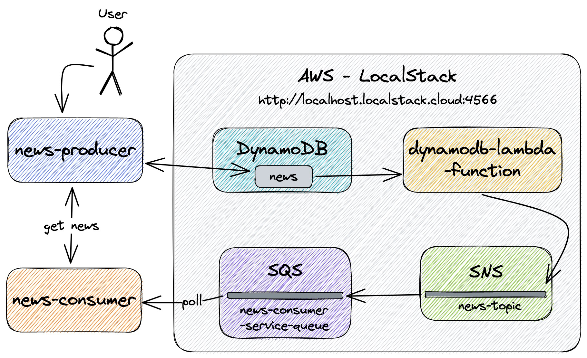
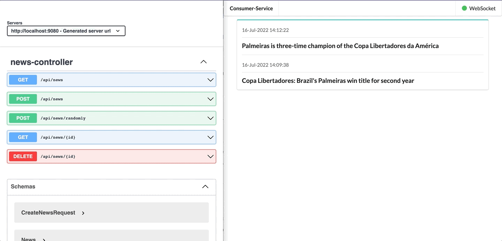

# springboot-aws-localstack-dynamodb-lambda-sns-sqs

In this project, we are going to use [`LocalStack`](https://localstack.cloud/) to simulate locally, some services provided by [`AWS Cloud`](https://aws.amazon.com/) such as: [`DynamoDB`](https://aws.amazon.com/dynamodb/), [`Lambda`](https://aws.amazon.com/lambda/), [`SNS`](https://aws.amazon.com/sns/) and [`SQS`](https://aws.amazon.com/sqs/).

## Proof-of-Concepts & Articles

On [ivangfr.github.io](https://ivangfr.github.io), I have compiled my Proof-of-Concepts (PoCs) and articles. You can easily search for the technology you are interested in by using the filter. Who knows, perhaps I have already implemented a PoC or written an article about what you are looking for.

## Project Diagram



## Applications

- ### news-producer

  [`Spring Boot`](https://docs.spring.io/spring-boot/docs/current/reference/htmlsingle/) Java Web application that exposes a REST API to manage news.

  It has the following endpoints:
  ```
     GET /api/news
     GET /api/news/{id}
    POST /api/news {"title": "..."}
  DELETE /api/news/{id}
  ```

- ### dynamodb-lambda-function

  [`Spring Cloud Function`](https://docs.spring.io/spring-cloud-function/docs/current/reference/html/spring-cloud-function.html) application that uses [`AWS Adapter`](https://docs.spring.io/spring-cloud-function/docs/current/reference/html/aws.html) to convert it to a form that can run in `AWS Lambda`.

  `dynamodb-lambda-function` listens to events emitted by an event-source created to monitor changes in `DynamoDB`. Once it receives an event, it processes it and publishes a new event to `SNS`.

- ### news-consumer

  `Spring Boot` Java Web application that consumes the events that `dynamodb-lambda-function` publishes to `SNS`. These events are queued in a `SQS`.

## Prerequisites

- [`Java 17+`](https://www.oracle.com/java/technologies/downloads/#java17)
- [`Docker`](https://www.docker.com/)
- [`Docker-Compose`](https://docs.docker.com/compose/install/)

## Package dynamodb-lambda-function jar

- In a terminal, make sure you inside `springboot-aws-localstack-dynamodb-lambda-sns-sqs` root folder

- Run the following script
  ```
  ./package-dynamodb-lambda-function-jar.sh
  ```
  When `Maven` packaging finishes, the jar file generated in `dynamodb-lambda-function/target` folder is copied to `dynamodb-lambda-function/shared` folder

## Start and Initialize LocalStack

- In a terminal, make sure you are in inside `springboot-aws-localstack-dynamodb-lambda-sns-sqs` root folder

- Start `LocalStack` Docker container
  ```
  DEBUG=1 docker-compose up -d
  ```

- \[Optional\] Debug logs are enabled so that we have more insights about what is happening. To monitor `localstack` Docker container logs, run the command below
  ```
  docker logs localstack -f
  ```

- Initialize `LocalStack` by running the following script
  ```
  ./init-localstack.sh
  ```
  The script will create:
  - create `news-topic` in `SNS`;
  - create `news-consumer-queue` in `SQS`;
  - subscribe `news-consumer-queue` to `news-topic`;
  - create `News` table in `DynamoDB`;
  - create `ProcessDynamoDBEvent` Lambda function;
  - create an `event-source-mapping` to connect `DynamoDB` to `ProcessDynamoDBEvent` Lambda function.
  
  > **Warning**: it takes around 5 minutes for the `ProcessDynamoDBEvent` Lambda function to have an `Active` state.

## Running applications with Maven

- **news-producer**

  In a terminal and, inside `springboot-aws-localstack-dynamodb-lambda-sns-sqs` root folder, run the following command
  ```
  ./mvnw clean spring-boot:run --projects news-producer -Dspring-boot.run.jvmArguments="-Daws.accessKey=key -Daws.secretAccessKey=secret"
  ```

- **news-consumer**

  In another terminal and, inside `springboot-aws-localstack-dynamodb-lambda-sns-sqs` root folder, run the command below
  ```
  ./mvnw clean spring-boot:run --projects news-consumer -Dspring-boot.run.jvmArguments="-Daws.accessKey=key -Daws.secretAccessKey=secret"
  ```

## Running applications as Docker container

- ### Build Docker images

  In a terminal and, inside `springboot-aws-localstack-dynamodb-lambda-sns-sqs` root folder, run the following script
  ```
  ./docker-build.sh
  ```

- ### Run Docker containers

  - **news-producer**

    In a terminal, run the following command
    ```
    docker run --rm --name news-producer -p 9080:9080 \
      -e AWS_ACCESS_KEY=key -e AWS_SECRET_ACCESS_KEY=secret \
      --network=springboot-aws-localstack-dynamodb-lambda-sns-sqs_default \
      ivanfranchin/news-producer:1.0.0
    ```

  - **news-consumer**

    In a new terminal, run the command below
    ```
    docker run --rm --name news-consumer -p 9081:9081 \
      -e AWS_ACCESS_KEY=key -e AWS_SECRET_ACCESS_KEY=secret \
      -e NEWS_PRODUCER_URL=http://news-producer:9080 \
      --network=springboot-aws-localstack-dynamodb-lambda-sns-sqs_default \
      ivanfranchin/news-consumer:1.0.0
    ```

## Application URL

| Application     | Type    | URL                                   |
|-----------------|---------|---------------------------------------|
| `news-producer` | Swagger | http://localhost:9080/swagger-ui.html |
| `news-consumer` | UI      | http://localhost:9081                 |

## Playing around

- **Creating news**

  - In a terminal, run the following command
    ```
    curl -i -X POST http://localhost:9080/api/news \
      -H 'Content-Type: application/json' \
      -d '{"title": "Palmeiras is three-time champion of the Copa Libertadores da América"}'
    ```

    or to create news randomly
    ```
    curl -i -X POST http://localhost:9080/api/news/randomly
    ```

  - In `news-consumer` UI, the news should be displayed

- **Deleting news**

  - In a terminal, run the following command
    ```
    curl -i -X DELETE http://localhost:9080/api/news/<NEWS-ID>
    ```

  - In `news-consumer` UI, the news should be removed

## Demo

In the `GIF` below, we use `news-producer` Swagger UI to create one random news. Then, we delete the news created previously. Finally, we create more two news randomly.



## Shutdown

- To stop applications, go to the terminal where they are running and press `Ctrl+C`
- To stop and remove `docker-compose` containers, network and volumes, go to a terminal and, inside `springboot-aws-localstack-dynamodb-lambda-sns-sqs` root folder, run the following command
  ```
  docker-compose down -v
  ```

## Cleanup

To remove the Docker images created by this project, go to a terminal and, inside `springboot-aws-localstack-dynamodb-lambda-sns-sqs` root folder, run the script below
```
./remove-docker-images.sh
```
